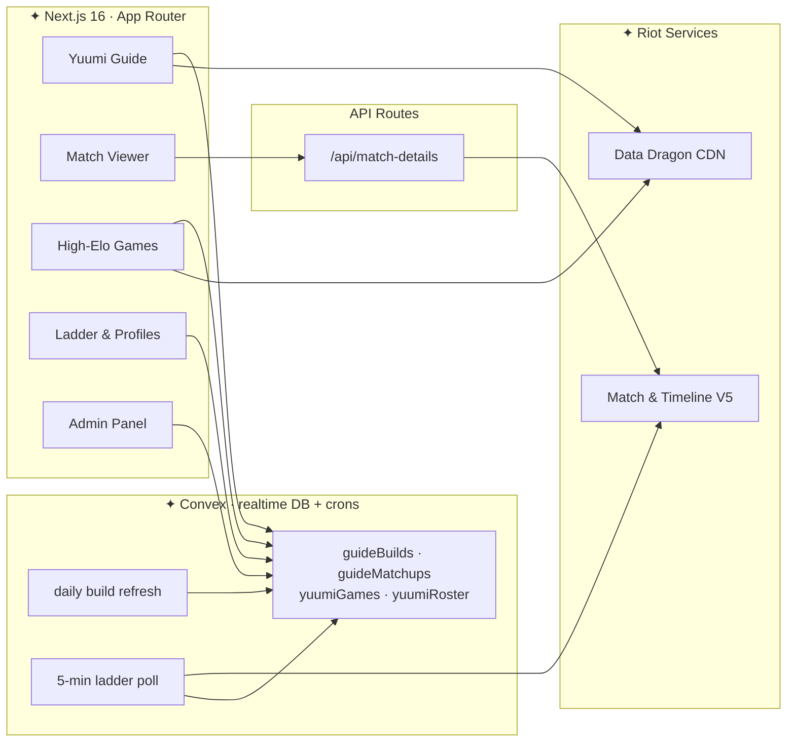

<!-- ✦ ────────────────────────  yuumi.quest  ──────────────────────── ✦ -->

<div align="center">


<a href="https://yuumi.quest">
  
</a>

<br/><br/>

<!-- Forged in hextech gold, cooled in magic teal -->
<a href="https://nextjs.org/"></a>
<a href="https://react.dev/"></a>
<a href="https://www.typescriptlang.org/"></a>
<a href="https://tailwindcss.com/"></a>
<a href="https://convex.dev/"></a>
<a href="LICENSE"></a>

<br/>

<a href="https://yuumi.quest"></a>
<a href="https://discord.gg/yuumi"></a>
<a href="https://github.com/MercyMeow/YuumiChallenges"></a>

</div>


## ✦ The Grimoire

> **yuumi.quest** is the companion app for Yuumi mains — a League of Legends guide, match viewer, and live high-elo tracker bound in the old LoL client's hextech magic: **dark navy plates, forged-gold frames, glowing teal runes**, with a flick of the Magical Cat's purple-pink sparkle.

Everything the Book could ask for lives under one roof. The recommended build **refreshes itself daily** and stamps exactly when it was last forged. Ability tips, matchup scrolls, and synergy notes are curated against the live patch and rendered with real Data Dragon icons, cooldowns, and keyword highlighting. And when you want to see how the best cats in the world are actually playing, the **high-elo feed** pulls every Master+ Yuumi game from every region — refreshed every five minutes.


## ✦ Chapters

<table>
<tr>
<td width="50%" valign="top">

### 📘 Yuumi Guide

`/` &nbsp;·&nbsp; _home_

- **Self-updating builds** — refreshed daily with a "last forged" stamp; a curated build stands in whenever the backend is asleep
- **Ability guide** — interactive spell selector with Data Dragon icons, live cooldown / mana chips, and wiki-verified tips
- **Matchup & synergy scrolls** — every enemy support and ally ADC with full kit icons, highlighted tips, and rune / item tweaks
- **Scroll-spy rails** — the client-style side rail tracks the section you're reading

</td>
<td width="50%" valign="top">

### 🔭 Match Viewer

`/match/{REGION}_{MATCH_ID}`

- **Overview** — rosters, objective control, and support-item timing
- **Detailed stats** — damage, vision, and gold side-by-side
- **Runes** — full pages with derived variable metrics
- **Timeline** — swap combat ⇄ item timelines on the fly
- **Challenges** — Riot progress plus community **Yuumi Challenges**

</td>
</tr>
<tr>
<td width="50%" valign="top">

### 🏆 High-Elo Games Feed

`/games`

- Every **Master+ solo-queue Yuumi game** across all regions
- Covers the **current patch and the one before**
- Refreshed **every five minutes**, straight from Riot
- Filter by region, patch, and win / loss — then open any game in the full viewer

</td>
<td width="50%" valign="top">

### 🐟 Yuumi Ladder & Profiles

`/players` &nbsp;·&nbsp; `/players/{region}/{riotId}`

- The **Master+ Yuumi ladder**, ranked by tier and LP
- Per-player **profiles** with worldwide Yuumi rank, season winrate, and recent games
- Build snapshots — runes, items, and spells — pulled from live games

</td>
</tr>
<tr>
<td width="50%" valign="top">

### ✨ Mythic Shop Timers

_site-wide banner_

- Live UTC reset countdowns for the Mythic Shop — daily, weekly, bi-weekly, and featured rotations

</td>
<td width="50%" valign="top">

### 🖼️ Rule Gallery &nbsp;·&nbsp; 🛠️ Admin

`/gallery` &nbsp;·&nbsp; `/admin`

- Discord-shareable rule GIFs with rich embeds
- Auth-gated management for builds, items, and text sections

</td>
</tr>
</table>


## ✦ How It's Woven




## ✦ Summon It Locally

```bash
# ✦ 1 — Clone the grimoire
git clone https://github.com/MercyMeow/YuumiChallenges.git
cd YuumiChallenges

# ✦ 2 — Install the reagents
npm install

# ✦ 3 — Add your keys
cp .env.example .env.local   # Windows: Copy-Item .env.example .env.local

# ✦ 4 — Summon Next.js + Convex together
npm run dev
```

Open **[http://localhost:3000](http://localhost:3000)** and you're flying. 🪶

**First deployment?** Push the backend and seed the guide tables:

```bash
npx convex deploy               # push schema & functions
npx convex run seed:seedAll     # seed builds, matchups & sections
```

> The site degrades gracefully — without Convex it falls back to the very same static data the seeder uses, so the database and the fallback never drift apart. The recommended build refreshes itself daily, and the high-elo feed fills in within minutes of the first scheduled run.


## ✦ Spellbook Configuration

<details>
<summary><b>Environment variables (.env.local)</b></summary>

<br/>

| Variable | Required | Purpose |
| --- | :---: | --- |
| `RIOT_API_KEY` | live data | Server-side Riot API access (match viewer + high-elo feed) |
| `NEXT_PUBLIC_CONVEX_URL` | ✅ | Convex deployment URL |
| `CONVEX_SELF_HOSTED_URL` | self-host | Self-hosted Convex endpoint |
| `CONVEX_SELF_HOSTED_ADMIN_KEY` | self-host | Self-hosted Convex admin key |
| `CONVEX_DEPLOY_KEY` | cloud prod | Convex cloud deploy key |
| `NEXT_PUBLIC_SITE_URL` | prod | Canonical & Open Graph URLs |
| `NEXT_PUBLIC_USE_EXAMPLE_DATA` | optional | Serve bundled example match payloads |

Grab a development key from the [Riot Developer Portal](https://developer.riotgames.com/). Convex runs in the cloud **or fully self-hosted** — both are supported.

</details>


## ✦ Inside the Grimoire

```text
YuumiChallenges/
├── src/
│   ├── app/                 # App Router routes + hextech design system (globals.css)
│   │   ├── api/             # match-details proxy
│   │   ├── games/           # high-elo Yuumi games feed
│   │   ├── players/         # Yuumi ladder + player profiles
│   │   ├── match/           # match viewer
│   │   ├── gallery/         # rule GIF gallery
│   │   ├── admin/           # auth-gated content management
│   │   └── rule[id].gif/    # Discord-embeddable rule routes
│   ├── components/
│   │   ├── guide/           # ability guide, matchup scrolls, rail panels
│   │   ├── match-history/   # match viewer tabs & widgets
│   │   ├── highelo/         # games feed + ladder cards
│   │   ├── mythic-shop/     # reset-timer banner
│   │   ├── shell/           # LoL-client chrome (TopNav, SideRail, PawEmblem)
│   │   └── ui/              # hextech primitives (panels, Data Dragon images)
│   └── lib/                 # builds, matchups, runes, Data Dragon clients, hooks
├── convex/                  # schema, guide CRUD, auth, seeding, live feeds + crons
├── data/                    # Yuumi challenge definitions
├── docs/                    # design docs & feature plans
└── public/                  # static assets + rule GIFs
```


## ✦ Forged With

<div align="center">

| Layer | Reagents |
| :---: | :--- |
| **Framework** | Next.js 16 App Router · Turbopack |
| **Language** | React 19 · TypeScript 6 (strict, `noUncheckedIndexedAccess`) |
| **Backend** | Convex — realtime DB, functions & crons (cloud or self-hosted) |
| **Styling** | Tailwind CSS 4 (CSS-first `@theme`) · Radix UI · CVA · Cinzel display |
| **Live data** | Riot Match & Timeline V5 · Data Dragon CDN |
| **Tooling** | Zod 4 · Lucide · date-fns · Sonner · ESLint · Prettier |

</div>


## ✦ Incantations

| Command | What it does |
| --- | --- |
| `npm run dev` | Next.js (Turbopack) + Convex dev servers together |
| `npm run dev:next` | Next.js only — Convex-less, static fallbacks |
| `npm run build` | Production build (deploys Convex first) |
| `npm run lint` / `lint:fix` | ESLint — check / auto-fix |
| `npm run format` / `format:check` | Prettier — write / check |
| `npm run type-check` | TypeScript diagnostics, no emit |


## ✦ Join the Bandlewood

Contributions are welcome, friend! Before opening a PR:

1. Follow **[Conventional Commits](https://www.conventionalcommits.org/)** (`feat:`, `fix:`, `chore:`).
2. Run `npm run lint`, `npm run format:check`, `npm run type-check`, and `npm run build`.
3. Link related issues (`Closes #123`) and attach captures for visual changes.
4. If you touch guide data under `src/lib/`, re-run `npx convex run seed:seedAll` so the database matches.

See [`AGENTS.md`](AGENTS.md) for coding standards and [`docs/`](docs/) for design notes and rune internals.


## ✦ Fine Print

> yuumi.quest is an **unofficial, community project** and is **not endorsed by or affiliated with Riot Games**. League of Legends and all related assets are trademarks of Riot Games, Inc. API use must comply with the [Riot API Terms of Service](https://developer.riotgames.com/).

Released under the **[MIT License](LICENSE)** · © 2026 MercyMeow.

<div align="center">


**Made with ♥ for Yuumi mains worldwide**

<a href="https://yuumi.quest"><b>Visit the site</b></a> &nbsp;·&nbsp; <a href="https://discord.gg/yuumi"><b>Join the Discord</b></a>

</div>
