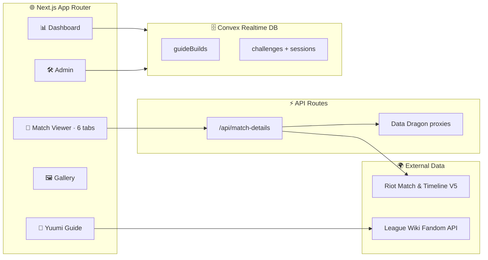

<!-- ░░░░░░░░░░░░░░░░░░░░░░░░░░░░░░░░░░░░░░░░░░░░░░░░░░░░░░░░░░░░░░░░░░░░ -->

<div align="center">


<br/>

<a href="https://yuumi.quest">
  
</a>

<br/><br/>

<!-- Tech badges -->
<a href="https://nextjs.org/"></a>
<a href="https://react.dev/"></a>
<a href="https://www.typescriptlang.org/"></a>
<a href="https://tailwindcss.com/"></a>
<a href="https://convex.dev/"></a>
<a href="LICENSE"></a>

<br/>

<!-- Live links -->
<a href="https://yuumi.quest"></a>
<a href="https://discord.gg/yuumi"></a>
<a href="https://github.com/MercyMeow/YuumiChallenges"></a>

</div>


## ✨ Overview

> **Yuumi Challenges** turns raw Riot **Match-V5** & **Timeline-V5** payloads into deep, role-aware breakdowns — purpose-built for League of Legends support mains, with a dedicated layer for tracking community **Yuumi Challenges** alongside standard analytics.

Drop in a match ID, and watch objectives, kill chains, rune pacing, support-item timing, and challenge progress come alive on an interactive timeline. Pair it with the built-in **Yuumi guide**, a personal **dashboard**, a shareable **rule GIF gallery**, and an authenticated **admin** content engine backed by a real-time Convex database.


## 🚀 Features

<table>
<tr>
<td width="50%" valign="top">

### 🔭 Match Viewer
`/match/{REGION}_{MATCH_ID}`

- **Overview** — rosters, objective control & support-item timing
- **Detailed Stats** — side-by-side damage, vision & gold
- **Runes** — rune pages with derived variable metrics
- **Timeline** — swap combat ⇄ item timelines on the fly
- **Challenges** — Riot in-game challenge progress
- **🐱 Yuumi Challenges** — community challenge evaluation

</td>
<td width="50%" valign="top">

### 📘 Yuumi Guide
`/` (home)

- Runes, items, skill orders for the current patch
- Matchups vs ADCs & supports + synergies
- **Mythic Shop** rotation with live UTC reset timers
- Region picker + full match-ID launcher

</td>
</tr>
<tr>
<td width="50%" valign="top">

### 📊 Player Dashboard
`/dashboard`

- Profile, **challenges** tracker & **leaderboard**
- Real-time progress synced through Convex
- Auth-gated personal views

</td>
<td width="50%" valign="top">

### 🖼️ Rule Gallery & 🛠️ Admin
`/gallery` · `/admin`

- Discord-shareable rule GIFs
- Authenticated content management
- Data scraper for U.GG / OP.GG / Lolalytics imports

</td>
</tr>
</table>


## 🧭 Architecture




## ⚡ Quick Start

```bash
# 1 — Clone
git clone https://github.com/MercyMeow/YuumiChallenges.git
cd YuumiChallenges

# 2 — Install
npm install

# 3 — Configure (add your RIOT_API_KEY)
cp .env.example .env.local   # Windows: Copy-Item .env.example .env.local

# 4 — Launch (Next.js + Convex together)
npm run dev
```

Open **[http://localhost:3000](http://localhost:3000)** and you're flying. 🪶

> **No Riot key?** Run in **example mode** — append `?useExample=1` to any match URL or set `NEXT_PUBLIC_USE_EXAMPLE_DATA=true` (requires local example payload files).


## 🔧 Configuration

<details>
<summary><b>Environment variables (.env.local)</b></summary>

<br/>

| Variable | Required | Purpose |
| --- | :---: | --- |
| `RIOT_API_KEY` | live data | Server-side Riot API access |
| `NEXT_PUBLIC_CONVEX_URL` | ✅ | Convex deployment URL |
| `CONVEX_DEPLOY_KEY` | prod | Convex production deploy key |
| `NEXT_PUBLIC_SITE_URL` / `NEXT_PUBLIC_APP_URL` | prod | Canonical & Open Graph URLs |
| `NEXT_PUBLIC_USE_EXAMPLE_DATA` | optional | Force bundled example payload |
| `YUUMI_DISCORD_SERVER_ID` | optional | Discord guild integration |
| `NEXT_PUBLIC_TIMELINE_DEBUG` / `NEXT_PUBLIC_RUNE_DEBUG` | optional | Verbose dev diagnostics (`1`) |

Grab a development key from the [Riot Developer Portal](https://developer.riotgames.com/).

</details>


## 🗂️ Project Structure

```text
YuumiChallenges/
├── src/
│   ├── app/            # App Router routes, layouts, globals.css
│   │   ├── api/        # Data Dragon proxies + match-details route
│   │   ├── match/      # Match viewer
│   │   ├── dashboard/  # Profile · challenges · leaderboard
│   │   ├── gallery/    # Rule GIF gallery
│   │   └── admin/      # Auth-gated content management + scraper
│   ├── components/     # UI primitives + match-details tabs
│   ├── contexts/       # Auth + Theme providers
│   ├── hooks/          # Data + selection hooks
│   └── lib/            # Riot/Data Dragon clients, runes, types, utils
├── convex/             # Realtime schema, queries, mutations, auth
├── data/               # Yuumi challenge definitions
├── docs/               # Architecture & feature notes
└── public/             # Static assets + rule GIFs
```


## 🛠️ Tech Stack

<div align="center">

| Layer | Technology |
| :---: | :--- |
| **Framework** | Next.js 15 App Router · Turbopack |
| **Language** | React 19 · TypeScript 5 (strict) |
| **Backend** | Convex — real-time database & functions |
| **Styling** | Tailwind CSS 3 · shadcn/ui (New York) · Radix UI |
| **Tooling** | Lucide icons · Zod validation · Vercel Speed Insights |

</div>


## 📜 Scripts

| Command | Description |
| --- | --- |
| `npm run dev` | Start Turbopack dev server + Convex |
| `npm run build` | Production build (deploys Convex first) |
| `npm start` | Serve the production build |
| `npm run lint` / `lint:fix` | Run ESLint (and auto-fix) |
| `npm run format` / `format:check` | Prettier write / check |
| `npm run type-check` | TypeScript diagnostics, no emit |


## 🤝 Contributing

Contributions are welcome! Before opening a PR:

1. Follow **Conventional Commits** (`feat:`, `fix:`, `chore:`).
2. Run `npm run lint`, `npm run format`, `npm run type-check`, and `npm run build`.
3. Link related issues (`Closes #123`) and include UI captures for `src/app/` changes.

See [`AGENTS.md`](AGENTS.md) for coding standards and [`docs/`](docs/) for rune & mythic-shop internals.


## ⚖️ Disclaimer & License

> Yuumi Challenges is an **unofficial, community project** and is **not endorsed by or affiliated with Riot Games**. League of Legends and all related assets are trademarks of Riot Games, Inc. API use must comply with the [Riot API Terms of Service](https://developer.riotgames.com/).

Released under the **[MIT License](LICENSE)**.

<br/>

<div align="center">


<a href="https://discord.gg/yuumi"><b>Join the Discord</b></a> · <a href="https://yuumi.quest"><b>Visit the site</b></a>

</div>
