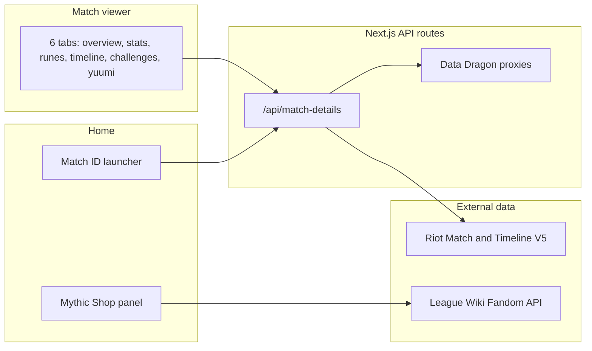

# 🐱 Yuumi Challenges

<div align="center">

**Timeline-aware League of Legends match analysis, built for Yuumi mains.**

Paste any `{REGION}_{MATCH_ID}` and explore objectives, kill chains, rune
pacing, support-item timing, and Yuumi-specific challenge progress.

[](https://nextjs.org/)
[](https://react.dev/)
[](https://www.typescriptlang.org/)
[](https://tailwindcss.com/)
[](LICENSE)

[Live site](https://yuumi.quest) · [Discord](https://discord.gg/yuumi) · [Repository](https://github.com/MercyMeow/YuumiChallenges)

</div>

---

## Overview

Yuumi Challenges is a Next.js App Router application that turns Riot
Match-V5 and Timeline-V5 payloads into deep, role-aware match breakdowns.
It is purpose-built for League of Legends support mains, with a dedicated
tab for tracking community **Yuumi Challenges** alongside standard match
analytics.



## Features

### Match viewer (`/match/{REGION}_{MATCH_ID}`)

- **Overview** – team rosters, objective control, and support-item
  completion timing.
- **Detailed Stats** – side-by-side player comparison with damage, vision,
  and gold metrics.
- **Runes** – rune pages with derived variable metrics (see
  [`docs/rune-variables.md`](docs/rune-variables.md)).
- **Timeline** – swap between combat and item timelines, processed on the
  fly.
- **Challenges** – Riot in-game challenge progress for the match.
- **Yuumi Challenges** – community challenge evaluation powered by
  [`data/yuumi-challenges.json`](data/yuumi-challenges.json) and
  [`yuumi-challenge-evaluator.ts`](src/components/match-details/yuumi-challenge-evaluator.ts).

### Home utilities

- Region picker + match-ID launcher with full `{REGION}_{MATCH_ID}`
  validation.
- **Mythic Shop rotation** panel with locally computed UTC reset timers
  (see [`docs/mythic-shop-rotation.md`](docs/mythic-shop-rotation.md)).

### Developer experience

- Turbopack dev server and lazy-loaded heavy tabs for fast initial load.
- In-memory match cache in
  [`api/match-details`](src/app/api/match-details/[matchId]/route.ts).
- Optional **example mode** (`?useExample=1` or
  `NEXT_PUBLIC_USE_EXAMPLE_DATA=true`) for running without a Riot key, when
  local example payload files are present.

## Quick start

### Prerequisites

- **Node.js** 18+ (20 LTS recommended)
- **npm**

### Installation

1. Clone the repository:

```bash
git clone https://github.com/MercyMeow/YuumiChallenges.git
cd YuumiChallenges
```

2. Install dependencies:

```bash
npm install
```

3. Create your local environment file:

```bash
# macOS/Linux
touch .env.local

# Windows PowerShell
New-Item .env.local -ItemType File
```

Add a `RIOT_API_KEY` to fetch live match data (see
[Configuration](#configuration)).

4. Start the development server:

```bash
npm run dev
```

5. Open [http://localhost:3000](http://localhost:3000).

## Configuration

Runtime configuration lives in `.env.local`:

| Variable | Required | Purpose |
| --- | --- | --- |
| `RIOT_API_KEY` | For live data | Server-side Riot API access ([match-details route](src/app/api/match-details/[matchId]/route.ts)). |
| `NEXT_PUBLIC_SITE_URL` / `NEXT_PUBLIC_APP_URL` | Production | Canonical and Open Graph URLs ([`layout.tsx`](src/app/layout.tsx)). |
| `NEXT_PUBLIC_USE_EXAMPLE_DATA` | Optional | Force the bundled example payload instead of live data. |
| `YUUMI_DISCORD_SERVER_ID` | Optional | Discord guild integrations ([`src/lib/apis/discord.ts`](src/lib/apis/discord.ts)). |
| `NEXT_PUBLIC_TIMELINE_DEBUG` / `NEXT_PUBLIC_RUNE_DEBUG` | Optional | Verbose dev diagnostics (set to `1`). |

> Without a `RIOT_API_KEY`, live match fetches return an error. Example
> mode requires local `exampleMatchData.json` / `exampleTimelineData.json`
> files (gitignored, not shipped in the repo).

Grab a development key from the
[Riot Developer Portal](https://developer.riotgames.com/).

## Usage

- **Landing page** (`/`) – pick a region and enter a numeric match ID, or
  paste a full `EUW1_7481411158`-style ID.
- **Direct URL** – navigate to `/match/EUW1_7481411158`.
- **Example match** – append `?useExample=1` (for example
  `/match/EUW1_7481411158?useExample=1`) to load the sample payload when
  example files are available locally.

## Project structure

```text
YuumiChallenges/
├── src/
│   ├── app/                 # App Router routes, layouts, globals.css
│   │   ├── api/             # Data Dragon proxies + match-details route
│   │   └── match/           # Match viewer route
│   ├── components/          # UI, match-details tabs, mythic-shop panel
│   ├── hooks/               # Data + selection hooks (use-match-data, ...)
│   ├── contexts/            # Theme provider
│   └── lib/                 # Riot/Data Dragon clients, runes, utils, types
├── data/                    # Yuumi challenge definitions
├── docs/                    # Architecture and feature notes
├── public/                  # Static assets
└── package.json
```

## Tech stack

- [Next.js 15](https://nextjs.org/) App Router with Turbopack
- [React 19](https://react.dev/) + [TypeScript 5](https://www.typescriptlang.org/)
- [Tailwind CSS](https://tailwindcss.com/) with
  [shadcn/ui](https://ui.shadcn.com/) (New York style, see
  [`components.json`](components.json)) and [Radix UI](https://www.radix-ui.com/)
- [Lucide](https://lucide.dev/) icons, [Zod](https://zod.dev/) validation,
  and [Vercel Speed Insights](https://vercel.com/docs/speed-insights)

## Available scripts

| Command | Description |
| --- | --- |
| `npm run dev` | Start the Turbopack dev server |
| `npm run build` | Production build |
| `npm start` | Serve the production build |
| `npm run lint` / `npm run lint:fix` | Run ESLint (and auto-fix) |
| `npm run format` / `npm run format:check` | Prettier write / check |
| `npm run type-check` | TypeScript diagnostics, no emit |

## Contributing

Contributions are welcome. Before opening a PR:

1. Follow Conventional Commits (`feat:`, `fix:`, `chore:`).
2. Run `npm run lint`, `npm run format`, `npm run type-check`, and
   `npm run build`.
3. Link related issues (`Closes #123`) and include UI captures for
   `src/app/` changes.

See [`AGENTS.md`](AGENTS.md) for coding standards and [`docs/`](docs/) for
rune and mythic-shop internals.

## Data sources

- **Riot Games** – Match-V5, Timeline-V5, and Data Dragon via server-side
  API routes.
- **League Wiki (Fandom)** – community-maintained Mythic Shop rotation
  reference (Riot exposes no public API for it).

## Disclaimer

Yuumi Challenges is an unofficial, community project and is **not endorsed
by or affiliated with Riot Games**. League of Legends and all related
assets are trademarks or registered trademarks of Riot Games, Inc. Use of
the Riot API must comply with the
[Riot API Terms of Service](https://developer.riotgames.com/) and
developer policies.

## License

Released under the [MIT License](LICENSE).

---

<div align="center">

Made with 💜 for Yuumi mains everywhere. [Join the Discord](https://discord.gg/yuumi).

</div>
