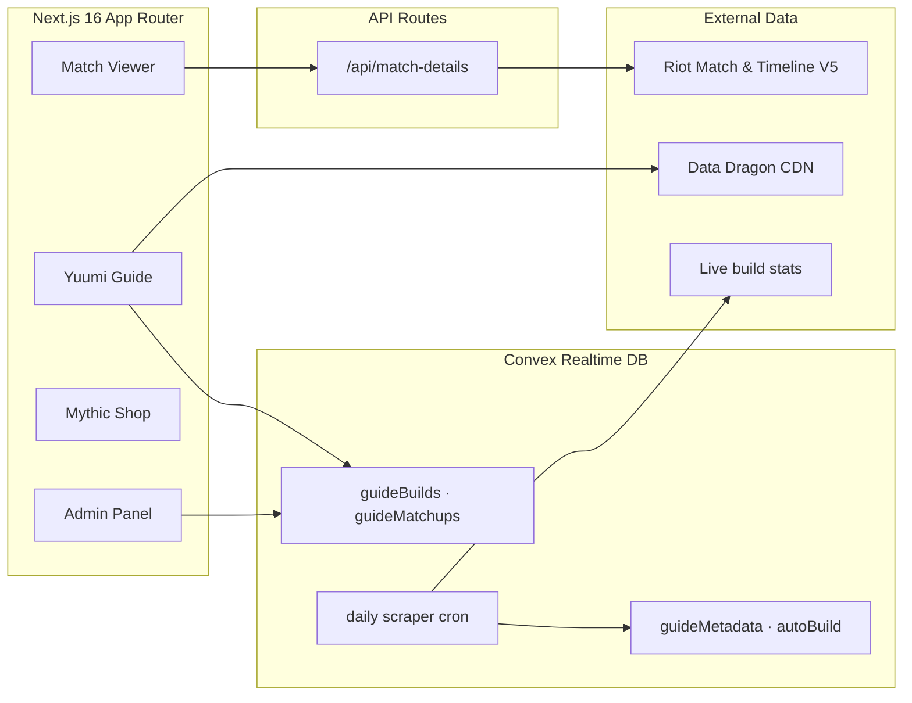

<!-- ✦ ─────────────────────────────────────────────────────────────── ✦ -->

<div align="center">


<a href="https://yuumi.quest">
  
</a>

<br/><br/>

<!-- Tech badges — forged in hextech gold -->
<a href="https://nextjs.org/"></a>
<a href="https://react.dev/"></a>
<a href="https://www.typescriptlang.org/"></a>
<a href="https://tailwindcss.com/"></a>
<a href="https://convex.dev/"></a>
<a href="LICENSE"></a>

<br/>

<a href="https://yuumi.quest"></a>
<a href="https://discord.gg/yuumi"></a>
<a href="https://github.com/MercyMeow/YuumiChallenges"></a>

</div>


## ✦ Overview

> **yuumi.quest** is a League of Legends companion for Yuumi mains, styled after the old LoL client's hextech magic — dark navy plates, forged-gold frames, glowing teal accents. It pairs a **self-updating Yuumi guide** with a timeline-aware **match viewer** and a real-time **Convex** backend.

The guide's recommended build refreshes itself on a daily cron and shows exactly when it was last forged. Ability tips, matchup scrolls, and synergy notes are curated against the current patch and rendered with live Data Dragon spell icons, cooldowns, and keyword highlighting — no text walls allowed in the bandlewood.


## ✦ Features

<table>
<tr>
<td width="50%" valign="top">

### 📘 Yuumi Guide

`/` (home)

- **Live builds** — daily auto-scrape with a "last updated" stamp; curated fallback when offline
- **Ability guide** — interactive spell selector with Data Dragon icons, live cooldown/mana chips, wiki-verified tips
- **Matchup & synergy scrolls** — every enemy support / ally ADC with their full kit icons, highlighted tips, rune & item adjustments
- **Scroll-spy nav** — the client-style rails track the section you're reading

</td>
<td width="50%" valign="top">

### 🔭 Match Viewer

`/match/{REGION}_{MATCH_ID}`

- **Overview** — rosters, objective control, support-item timing
- **Detailed stats** — damage, vision & gold side-by-side
- **Runes** — full pages with derived variable metrics
- **Timeline** — swap combat ⇄ item timelines on the fly
- **Challenges** — Riot progress + community **Yuumi Challenges**

</td>
</tr>
<tr>
<td width="50%" valign="top">

### ✨ Reset Timers

site-wide banner

- Live UTC Mythic Shop reset countdowns (daily / weekly / bi-weekly / featured)

</td>
<td width="50%" valign="top">

### 🖼️ Rule Gallery &nbsp;·&nbsp; 🛠️ Admin

`/gallery` · `/admin`

- Discord-shareable rule GIFs with rich embeds
- Auth-gated content management for builds, items & sections
- Data scraper for external build imports

</td>
</tr>
</table>


## ✦ Architecture




## ✦ Quick Start

```bash
# 1 — Clone
git clone https://github.com/MercyMeow/YuumiChallenges.git
cd YuumiChallenges

# 2 — Install
npm install

# 3 — Configure (add your keys)
cp .env.example .env.local   # Windows: Copy-Item .env.example .env.local

# 4 — Launch (Next.js + Convex together)
npm run dev
```

Open **[http://localhost:3000](http://localhost:3000)** and you're flying. 🪶

**First deployment?** Seed the guide tables and pull the first live build:

```bash
npx convex deploy                        # push schema & functions
npx convex run seed:seedAll              # seed builds, matchups, sections
npx convex run scraper:autoUpdateBuild   # fetch the current live build
```

> The site degrades gracefully — without Convex it falls back to the same static data the seeder uses, so DB and fallback never drift.


## ✦ Configuration

<details>
<summary><b>Environment variables (.env.local)</b></summary>

<br/>

| Variable | Required | Purpose |
| --- | :---: | --- |
| `RIOT_API_KEY` | live match data | Server-side Riot API access |
| `NEXT_PUBLIC_CONVEX_URL` | ✅ | Convex deployment URL |
| `CONVEX_SELF_HOSTED_URL` | self-hosting | Self-hosted Convex endpoint |
| `CONVEX_SELF_HOSTED_ADMIN_KEY` | self-hosting | Self-hosted Convex admin key |
| `CONVEX_DEPLOY_KEY` | cloud prod | Convex cloud deploy key |
| `NEXT_PUBLIC_SITE_URL` | prod | Canonical & Open Graph URLs |
| `NEXT_PUBLIC_USE_EXAMPLE_DATA` | optional | Serve bundled example match payloads |

Grab a development key from the [Riot Developer Portal](https://developer.riotgames.com/). Convex runs in the cloud **or fully self-hosted** — both are supported.

</details>


## ✦ Project Structure

```text
YuumiChallenges/
├── src/
│   ├── app/               # App Router routes + hextech design system (globals.css)
│   │   ├── api/           # match-details proxy
│   │   ├── admin/         # auth-gated CMS + scraper tools
│   │   ├── gallery/       # rule GIF gallery
│   │   ├── match/         # match viewer
│   │   └── rule[id].gif/  # Discord-embeddable rule routes
│   ├── components/
│   │   ├── guide/         # ability guide, matchup visuals, rail panels
│   │   ├── match-history/ # match viewer tabs & widgets
│   │   ├── shell/         # LoL-client chrome (TopNav, SideRail)
│   │   └── ui/            # hextech primitives (panels, Data Dragon images)
│   └── lib/               # builds, matchups, runes, Data Dragon clients, hooks
├── convex/                # schema, guide CRUD, auth, seeding, scraper + cron
├── data/                  # Yuumi challenge definitions
├── docs/                  # feature & data-source notes
└── public/                # static assets + rule GIFs
```


## ✦ Tech Stack

<div align="center">

| Layer | Technology |
| :---: | :--- |
| **Framework** | Next.js 16 App Router · Turbopack |
| **Language** | React 19 · TypeScript 6 (strict, `noUncheckedIndexedAccess`) |
| **Backend** | Convex — realtime DB, functions & crons (cloud or self-hosted) |
| **Styling** | Tailwind CSS 4 (CSS-first `@theme`) · Radix UI · CVA |
| **Tooling** | Zod 4 · Lucide icons · ESLint · Prettier |

</div>


## ✦ Scripts

| Command | Description |
| --- | --- |
| `npm run dev` | Next.js (Turbopack) + Convex dev servers |
| `npm run dev:next` | Next.js only (Convex-less, static fallbacks) |
| `npm run build` | Production build (deploys Convex first) |
| `npm run lint` / `lint:fix` | ESLint (and auto-fix) |
| `npm run format` / `format:check` | Prettier write / check |
| `npm run type-check` | TypeScript diagnostics, no emit |


## ✦ Contributing

Contributions are welcome! Before opening a PR:

1. Follow **Conventional Commits** (`feat:`, `fix:`, `chore:`).
2. Run `npm run lint`, `npm run format:check`, `npm run type-check`, and `npm run build`.
3. Link related issues (`Closes #123`) and include UI captures for visual changes.
4. If you touch guide data under `src/lib/`, re-run `npx convex run seed:seedAll` so the database matches.

See [`AGENTS.md`](AGENTS.md) for coding standards and [`docs/`](docs/) for rune internals.


## ✦ Disclaimer & License

> yuumi.quest is an **unofficial, community project** and is **not endorsed by or affiliated with Riot Games**. League of Legends and all related assets are trademarks of Riot Games, Inc. API use must comply with the [Riot API Terms of Service](https://developer.riotgames.com/).

Released under the **[MIT License](LICENSE)**.

<div align="center">


**Made with ♥ for Yuumi mains worldwide**

<a href="https://yuumi.quest"><b>Visit the site</b></a> · <a href="https://discord.gg/yuumi"><b>Join the Discord</b></a>

</div>
